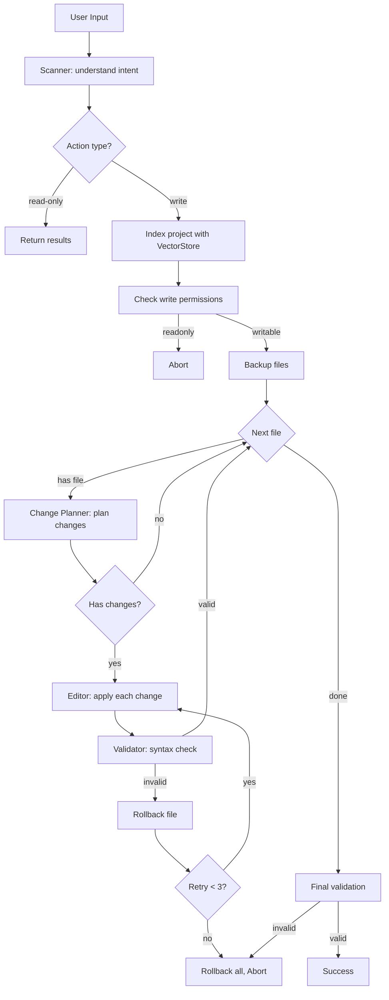

## Coding Assistant Agent

### Usage

```bash
uv run coding-agent [--project PATH] [--model PATH] [--remote-model NAME] [--no-index]
```

| Option | Description |
|--------|-------------|
| `--project`, `-p` | Project directory (default: `playground/pets`) |
| `--model`, `-m` | Path to local model, or `http(s)://` URL for remote server |
| `--remote-model` | Model name to request from remote server (default: `local`) |
| `--no-index` | Disable vector store indexing |

**Default**: OpenAI API (gpt-4o-mini). Set `OPENAI_API_KEY` env variable.

Model auto-detection by `--model` value:
- `http://` or `https://` URL → remote OpenAI-compatible server
- `.gguf` file → llama.cpp
- directory → MLX (mlx-lm)

```bash
uv run coding-agent                                           # OpenAI (default)
uv run coding-agent -p ./myproject                            # custom project
uv run coding-agent -m /path/to/model.gguf                   # local GGUF
uv run coding-agent -m /path/to/mlx-model/                   # local MLX
uv run coding-agent -m http://localhost:8080/v1               # llama.cpp server (default model name)
uv run coding-agent -m http://localhost:11434/v1 --remote-model qwen2.5-coder:32b  # Ollama
uv run coding-agent -m http://localhost:8000/v1 --remote-model mistralai/Mistral-7B # vLLM
uv run coding-agent --no-index                                # disable vectorstore
```

### Running tests

Requires `uv`, dev deps (pytest, pytest-asyncio). Integration tests call OpenAI API — set `OPENAI_API_KEY`.

```bash
uv sync
uv run pytest tests/ -v                          # all tests
uv run pytest tests/ -v --ignore=tests/agents    # unit tests only
uv run pytest tests/agents/ -v                   # agent evals (requires API)
```

### Architecture

```
User Input
    ↓
[Scanner] → understand intent, find files
    ↓
[Change Planner] → analyze file, plan atomic changes (skip similar names)
    ↓
[Editor] → apply each change (content-based replacement)
    ↓
[Validator] → syntax check entire file
    ↓
Success / Rollback
```

### Agents (6 total)

| Agent | Role | Output |
|-------|------|--------|
| Scanner | Understand intent, gather context via tools | `{action, target, files, data}` |
| Change Planner | Analyze file, plan specific changes | `[{original, instruction, skip}]` |
| Editor | Apply single change to code chunk | `{original, new_content}` |
| Validator | Check syntax, suggest fixes | Pass/fail + suggestion |
| Analyzer | Analyze runtime output for errors | Error analysis |
| Result Writer | Build JSON for result file | JSON object |

### Vector Store

Project uses LanceDB with tree-sitter for semantic code chunking:
- **Languages**: JavaScript, TypeScript, Python
- **Chunk types**: functions, classes, variables, interfaces
- **Embeddings**: OpenAI (`text-embedding-3-small`) or local (`sentence-transformers`)
- **Storage**: Ephemeral (cleared on each run)

Benefits:
- Editor works with relevant chunks instead of entire files
- Better context management for large files
- Semantic search for finding related code

### Change Planner

The Change Planner analyzes code and identifies all occurrences of the target:

```
Input: Rename function "max" to "min"
File: const { max } = require('./max'); MAX_DEPTH = 10; max();

Output:
- "const { max } = require" → rename import (skip: false)
- "MAX_DEPTH = 10" → different identifier (skip: true)  
- "max();" → rename call (skip: false)
```

This prevents:
- Renaming similar names (MAX_DEPTH vs max)
- Modifying string literals
- Changing comments

### Content-Based Editing

Editor uses content matching instead of line numbers:

```json
{"changes": [
  {"original": "function max()", "new_content": "function min()"},
  {"original": "max();", "new_content": "min();"}
]}
```

Changes are applied from end of file to prevent coordinate shifting.

### Supported Actions

| Action | Example | Flow |
|--------|---------|------|
| rename | "Rename function foo to bar" | Scanner → Planner → Editor → Validator |
| search | "Find all usages of printStack" | Scanner (grep) |
| explain | "What does max function do?" | Scanner (grep → cat) |
| fix | "Fix syntax error in luna.js" | Scanner → Editor → Validator |

### Tools

| Tool | Description |
|------|-------------|
| ls | List files in directory |
| cat | Read file content |
| grep | Search pattern in files (returns relative paths) |
| validate | Run syntax check (node --check) |
| run | Execute file and capture output |

### Limits (`src/coding_agent/limits.py`)

| Limit | Default | Description |
|-------|---------|-------------|
| Agent timeout | 20s | Per agent call |
| Scanner timeout | 40s | Scanner has more time for tool calls |
| Max tokens | 20,000 | Per completion |
| Tool calls per tool | 100 | Per tool name per run |
| Max retries | 3 | Per file modification |

### Error Handling

| Scenario | Action |
|----------|--------|
| Readonly file | Abort, list readonly files |
| Syntax error after edit | Rollback file, retry with error context |
| Max retries exceeded | Rollback all, abort |
| Agent timeout | Return error / fallback |
| Planner fails | Fallback to legacy editor (entire file) |

### Testing with LangSmith

Evals are traced to LangSmith for monitoring:

```python
from tests.langsmith_evals import LangSmithEvalRunner, EvalCase

runner = LangSmithEvalRunner()
cases = [EvalCase(name="test1", inputs={"task": "..."})]
results = await runner.run_all(cases, target_fn, evaluator_fn)
print(runner.summary())  # {"pass_rate": 0.95, "avg_score": 0.87, ...}
```

Set `LANGSMITH_API_KEY` for tracing.

### Result as JSON

If user asks to save result to JSON:
- **Filename**: `result.json`, `result0.json`, `result1.json`, …
- **Schema**: User-defined or agent-designed
- **Fallback**: `{"request", "action", "result"}`

### Flow Diagram


